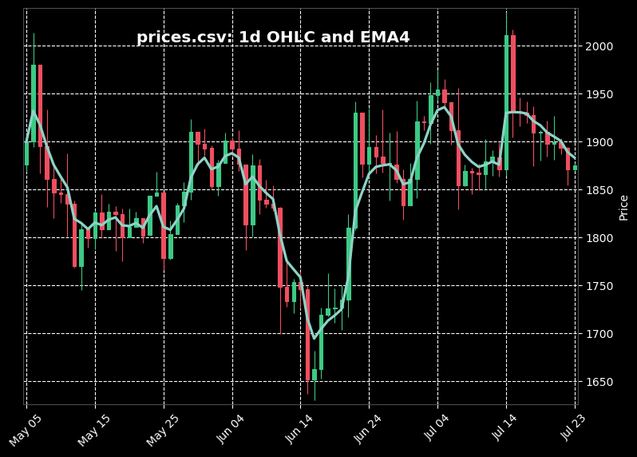

## candles_and_ema

Test assignment: implement candlesticks and EMA calculation with given 
csv-file. 

To run the project just do `python3 main.py`: application will automatically 
download csv file, process it and plot the results.

The following options allow you to customize calculations:
```bash
--period <value> # set candlesticks duration. See --help for available options
--length <value> # set EMA filtering depth
--csv <filepath> # set csv file to process
```

Run `python3 main.py --test` to start unit testing.

### Objective function

`numpy_implementation.py:calculate_ema()`

### Dependencies

- numpy
- pandas
- mplfinance
- pytest


## Output figure




