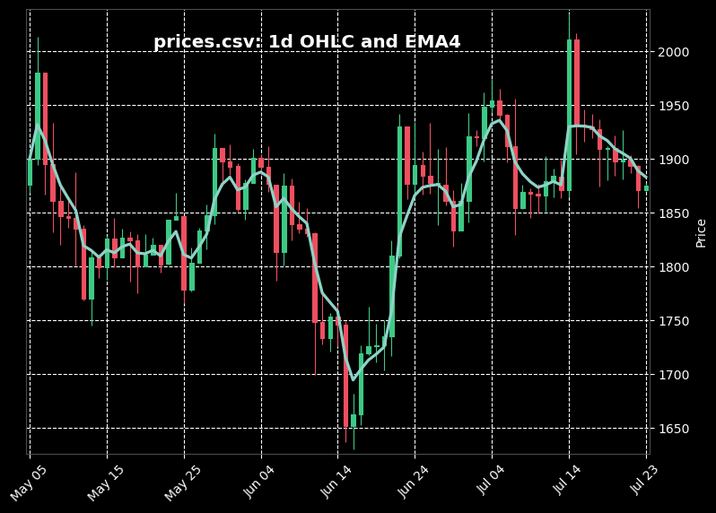

## candles_and_ema

Test assignment to implement candlesticks and EMA calculation for a given csv 
file. 

To run the project just do `python3 main.py`: application will automaticaly 
download csv file, process it and plot the results.

Following parameters will make some customization:
```bash
--period <value> # set candlesticks duration
--length <value> # set EMA filtering depth
--csv <filepath> # set csv file to process
```


### Dependencies

- numpy
- pandas
- mplfinance
- matplotlib


## Plots

### Numpy implementation:



